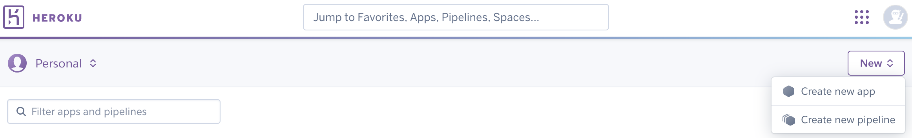

# Venture Vibes

Welcome to [Venture Vibes!](https://venture-vibes-e0fcf8943946.herokuapp.com/)

## Description
**Venture Vibes** is an adventure blog dedicated to showcasing the travel experiences of my partner and me, inspiring wanderlust, and providing valuable insights for fellow explorers. 
This project features a user-friendly platform where readers can discover captivating stories, and detailed destination guides. The blog aims to document our adventures and create an engaging community for travel enthusiasts. Venture Vibes invites you to join our journey and ignite your passion for travel.

## User Experience

### Wireframes

All wireframes were created using [Balsamiq](https://balsamiq.com/wireframes/). The purpose was to outline the basic structure and layout of the website.

<strong>Homepage</strong>

<strong>Blog</strong>

<strong>Blog Post</strong>

<strong>About</strong>

### User Stories

For this part of the project, I used [Notion](https://www.notion.so/) to work on my [project board](https://www.notion.so/Venture-Vibes-Project-Management-561b1b85789f49ce8c0ad37801c98188?pvs=4) using an agile approach.

<strong>Project Board</strong>

The project was guided by the following user story structure:
- **Title:** of the User Story
- **Description:** As a *role* I can *capability* so that *received benefit*
- **Acceptance Criteria:** Clear, measurable conditions that must be done in order for the user story to be considered complete
- **Tasks:** Actionable items needed to implement the user story

<strong>User Story Example</strong>

For a full list of user stories, visit the [User Stories](https://intriguing-caper-d96.notion.site/a850adf08793496bb36409cc238f0533?v=dd73d186fa8e4a9f85ccfa0c624279c8) or the previous link above.

### Design Choices

#### Color Scheme
The color scheme was created using [coolors](https://coolors.co/). I chose these colors to fit the feeling of exploration, nature and adventure. On top, since the first adventure is taking place in Iceland, I went for a cooler tone.

<strong>Color Palette</strong>

#### Typography

I decided to keep the typography simple by using a clean and readable sans-serif font. **Verdana** was the choice for me. Due to limitations with the Summernote editor in Django, I opted for
**Helvetica Neue**, a similar sans-serif font for the blog posts.

[Back to Top](#top)

## Features

### Existing Features

- **Stunning Visuals:** Captivating pictures accompany each story to immerse the reader in the experience
- **Commenting Capability:** Readers can share their experiences by commenting on posts
- **Like Functionality:** Show appreciation for favorite posts by liking them
- **Responsive Design:** Ensures optimal view across various devices
- **User-friendly Interface:** An intuitive website for browsing

#### Homepage
The **homepage** serves as the hub of **Venture Vibes** with an eye-catching banner, stunning travel images and featuring the latest blog post.

<strong>Navbar and Hero section</strong>

The navigation bar will be visible throughout every page you are visiting on the website. When clicking on the logo "Venture Vibes", you get redirected to the homepage.
In the middle of the bar you will find a "Home" button, a dropdown menu "Adventures" that has the current adventure as an item and the "About" page. In the Hero section, we welcome the user to our homepage.

User is authenticated

When the User is logged in, the navigation bar includes personalized options such as "Profile" and "Sign out", allowing the user to access their profile account.
Furthermore, the Hero Section is displaying buttons to the "Blog" and the "Contact Us" page.

User is not authenticated

When the User is not logged in, the navigation bar features buttons to "Login" and "Sign-up", animating to engage further with the website. The Hero Section is displaying buttons to the "Blog" and the "Join Us" page.

<strong>Carousel Images</strong>

The homepage features a carousel of three travel images, showcasing various destinations from the recent trip to Iceland. The goal is to entice them to explore the blog further.

<strong>Latest Blog Post</strong>

The homepage highlights the most recent blog post, giving readers a glimpse of the latest adventure, encouraging engagement with the freshest stories on the blog.

<strong>Footer</strong>

The footer provides essential links for staying connected. It includes social media icons, allowing users to follow the blog on platforms like X, Instagram and Facebook. And lets not forget the copyright notice.

#### Blog

The **Blog** section is the heart of Venture Vibes, where users can explore a variety of travel posts. This section features a hero section, card-based blog previews, and pagination to navigate through multiple posts with ease.

<strong>Hero Section</strong>

The blog section begins with a Hero Section that is used as an introduction to the chosen adventure. In this example, it's an epic road trip across Iceland, offering a preview of the adventure and inviting readers to join the journey.

The hero image complements the post, giving a visual glimpse of what readers can expect.

<strong>Blog Cards</strong>

Below the Hero section, the blog is organized into a series of Blog Cards. Each card contains:
- The title of the Blog Post
- The name of the author and the date the post was published
- A brief excerpt, meant to entice the user
- A call to action that takes the user to the full blog post

<strong>Pagination Controls</strong>

The blog page features Pagination Controls at the bottom, allowing users to navigate between different pages of blog posts.

#### Post Detail

The **Post Detail** page allows readers to dive deeper into each individual blog post. Users get a rich narrative that is supported by a stunning picture and opportunities to engage.

<strong>Hero Section</strong>

The hero section features the title of the post prominently along with a captivating image that sets the scene for the adventure discussed in the blog.

<strong>Post Content</strong>

The body of the post provides an engaging narrative. The publish date and author information are displayed at the bottom.

<strong>Like Button</strong>

Authenticated users can express their appreciation for the post by clicking the like button. The button visually indicates whether the user has liked the post and displays the total number of likes. For a visual, check the upcoming "Comments Section" pictures.

<strong>Comments Section</strong>

Authenticated user can engage with the content by leaving comments. The section displays the total number of comments, allowing users to read and interact with fellow travelers. Underneath is a simple comment form to do so. A post can be awaiting approval or you have the option to edit and delete your own post.

User is authenticated

User is not authenticated

#### About

The **About** page provides users with insights into the creators of **Venture Vibes**, sharing the passion and motivation behind the blog. It serves as a personal touchpoint, helping readers connect with the authors and understand the purpose of the platform. It features an image of the bloggers in a stunning location, visually representing the adventures that the blog discusses. A "Contact Us" button allows visitors to reach out for inquiries or collaborations for further engagement.

#### User Profile

The **User Profile** page allows users to view and manage their activity on **Venture Vibes**. It provides a personalized experience, showcasing approved and unapproved comments as well as posts the user has liked.

#### Admin Panel

The **Admin Panel** of **Venture Vibes** provides a django backend interface for managing content, users, and site settings. This allows the administrator to oversee all aspects of the website.

Important for managing Blog Posts:

<strong>Post Management</strong>

This section allows admins to create, edit, and delete blog posts, including an image.

<strong>Comment Moderation</strong>

Admins can review and approve or reject user comments. This feature helps to filter out inappropriate content.

### Features in Planning

The primary goal of **Venture Vibes** is to continuously add more adventures and enhance the user experience. With this growth in mind, the backend has been designed for modularity, breaking it down into smaller, manageable apps. If you're curious what is planned next, check out [User Stories](https://intriguing-caper-d96.notion.site/Venture-Vibes-Project-Management-561b1b85789f49ce8c0ad37801c98188).

[Back to Top](#top)

## Testing

### HTML Validator

HTML files have been validated using [W3C Markup Validation Service](https://validator.w3.org/) 
A common theme and the only error throughout the validation checks is a CSS error caused by using a newer CSS feature by summernote.

<strong>HTML Validator Results</strong>

Homepage

Blog Page

Post Detail

About

Contact Us

User Profile

404 Error

500 Error

In order to test this page, a 500 error has been simulated by raising an Exception in about views.

### CSS Validator
CSS file has been validated using [W3C CSS Validation Service](https://jigsaw.w3.org/css-validator/)

<strong>CSS Validator Result</strong>

### Javascript Code Analyzer
JS file has been analyzed by using [JSHint](https://jshint.com/)

<strong>JS Hint Analysis</strong>

### Python Code Linter
All altered Python files have been validated using [CI Python Linter](https://pep8ci.herokuapp.com/)

<strong>CI Python Linter Analysis</strong>

About

admin.py

models.py

urls.py

views.py

Blog

admin.py

forms.py

models.py

urls.py

views.py

Contact

admin.py

forms.py

models.py

urls.py

views.py

Profiles

urls.py

views.py

Venture_Vibes

Altough settings.py has been altered, I have not included it in the validation as it is focused on configurations

urls.py

views.py

### Responsiveness Test
I have tested the website on its responsiveness using [Google Chrome Dev Tools](https://developer.chrome.com/docs/devtools/) and ui.dev's [amiresponsive](https://ui.dev/amiresponsive)

### Lighthouse

The Lighthouse reports have been generated to audit the website for performance, accessibility, best practices, and SEO across various key pages.

<strong>Homepage</strong>

Desktop

Mobile

<strong>Blog Page</strong>

Desktop

Mobile

<strong>Post Detail</strong>

Desktop

Mobile

<strong>About</strong>

Desktop

Mobile

<strong>Contact Us</strong>

Desktop

Mobile

<strong>User Profile</strong>

Desktop

Mobile

### Manual Testing

Manual testing was performed to ensure the application meets the acceptance criteria outlined in the [User Stories](https://intriguing-caper-d96.notion.site/Venture-Vibes-Project-Management-561b1b85789f49ce8c0ad37801c98188). 
**Each User Story includes a dedicated task for testing.** 
I reviewed each user story and tested the corresponding features to ensure everything works as expected. Through manual testing, I confirmed that the application functions well and is user-friendly, meeting the needs and expectations of users.

### Peer Review

Friends, colleagues, and my mentor tested the application across various devices to ensure its functionality and usability. Their feedback helped identify areas for improvement, contributing to a more robust iteration of the application.

[Back to Top](#top)

## Deployment

**Venture Vibes** was deployed using [Heroku](https://www.heroku.com/) and is built upon a template from [Code Institute](https://github.com/Code-Institute-Org/ci-full-template).

1. **Heroku Setup**: 
- Create an account on Heroku and log in
- Click on **New** and choose **Create a new app**
- Follow the steps and click **Create app**

    

    
<strong>Create app</strong>

    
    
    

2. **Connect to Github Repository**:
- Go to the Deploy tab and look for Deployment method and select **Github**
- Search for your repository and click **Connect**

    

    
<strong>Connect to Repository</strong>

    
    

3. **Configure Heroku Settings**:
- Go to the Settings tab and select **Reveal Config Vars**
- Here, add sensitive but necessary data from your `env.py` file, such as database URLs and your secret key
- Ensure that all required environment variables are set for your application to function properly
- Scroll down to Buildpacks and click **Add buildpack**
- Choose **python** and click **Add Buildpack**

    

    
<strong>Settings Config & Buildpacks</strong>

    
    
    

4. **Deploy with Heroku**:
- Deploy the application using git push bash command in your IDE
- Go to Heroku Deploy tab and look for Manual Deploy and click **Deploy Branch**
- There is also an option to Enable Automatic Deploys

    

    
<strong>Manual Deploy</strong>

    
    

5. **Finalizing Deployment**:
- Once the deployment is complete, you will see a confirmation message, a new button called **View** will appear and the app will be live
- Click on **View** to open your live website

    

    
<strong>Deployment Success</strong>

    
    

[Back to Top](#top)

# Credits

## Content

- **Django 5 By Example**:
    Recommended by my [mentor](https://5pence.net/), this book by Antonio Melé was instrumental in boosting my understanding of Django.

- **Code Institute Walkthrough Project**:  
    Portions of code were reused from Code Institute’s walkthrough project, *"I think therefore I blog."* This served as a foundational resource for my blog functionality.

- **Walking the Wainwrights**:
    My cohort facilitator introduced me to Martin Bradbury's [Walking the Wainwrights](https://github.com/MartinBradbury/walking-the-wainwrights), which provided creative inspiration.

- **Images**:
    All images regarding the blog are original and were taken by myself.

- **README**:
    My README structure was inspired by my [previous project](https://github.com/yanidruffy/stratagem-hero) and insights from my colleague [Sebastian](https://github.com/Mienjung97/PROject-GOLFblog/blob/main/README.md).

## Development Tools

- **Bootstrap**:
    I used [Bootstrap](https://getbootstrap.com/) for styling and responsiveness, particularly benefiting from its grid system and components.

- **Black**:
    Code formatter [Black](https://pypi.org/project/black/) was used for the python files to ensure code consistency.

- **Beautify**:
    I used [Beautify](https://beautifier.io/) for formatting my HTML, CSS, and JavaScript code.

- **Perplexity**:
    Assisted in generating text for blog posts using [Perplexity](https://www.perplexity.ai/).

## References

- **Balsamiq**:
    Wireframes for the project were designed using [Balsamiq](https://balsamiq.com/wireframes/).

- **Coolors**:
    The color scheme was created using [Coolors](https://coolors.co/).

- **ImageResizer**:
    Image optimization and resizing were handled using [ImageResizer](https://imageresizer.com/).

- **Heroku**:
    The project was successfully deployed on [Heroku](https://www.heroku.com/).

- **Notion**:
    I organized my project through [Notion](https://www.notion.so/).

## Acknowledgements

- A big thank you to my [mentor](https://5pence.net/) and my friends and colleagues for reviewing the project and providing invaluable feedback that greatly improved both the design and functionality.
- Special thanks to Roo from the Code Institute's Support Team for his guidance.
- I also want to express my gratitude to my partner, who accompanied me on this adventure. Your support has been invaluable.

[Back to Top](#top)