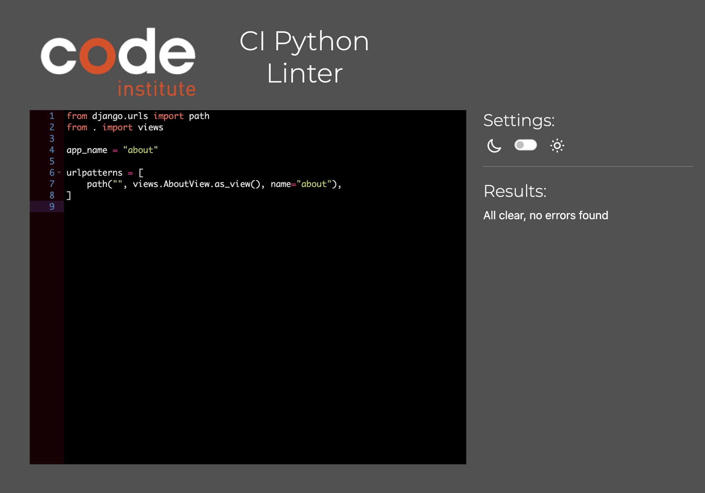
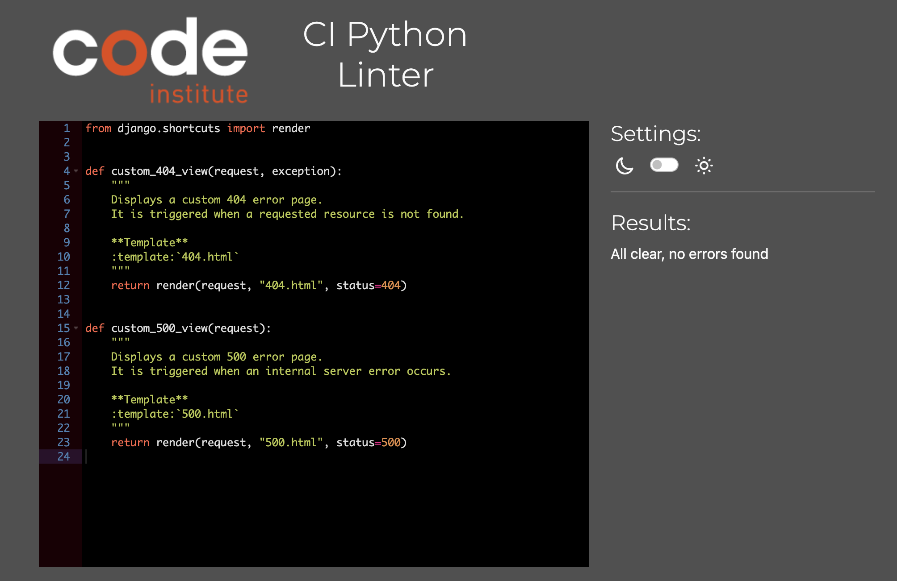

# Venture Vibes

Welcome to [Venture Vibes!](https://venture-vibes-e0fcf8943946.herokuapp.com/)

## Description
**Venture Vibes** is an adventure blog dedicated to showcasing my partner and I's travel experiences, inspiring wanderlust, and providing valuable insights for fellow explorers. 
This project features a user-friendly platform where readers can discover captivating stories, and detailed destination guides. The blog aims to document our adventures and create an engaging community for travel enthusiasts. Venture Vibes invites you to join our journey and ignite your passion for travel.

## Testing

### HTML Validator

HTML files have been validated using [W3C Markup Validation Service](https://validator.w3.org/) 
A common theme and the only error throughout the validation checks is a CSS error caused by using a newer CSS feature by summernote.

<strong>HTML Validator Results</strong>

Homepage

Blog Page

Post Detail

About

Contact Us

User Profile

404 Error

500 Error

In order to test this page, a 500 error has been simulated by raising an Exception in about views.

### CSS Validator
CSS file has been validated using [W3C CSS Validation Service](https://jigsaw.w3.org/css-validator/)

<strong>CSS Validator Result</strong>

### Javascript Code Analyzer
JS file has been analyzed by using [JSHint](https://jshint.com/)

<strong>JS Hint Analysis</strong>

### Python Code Linter
All altered Python files have been validated using [CI Python Linter](https://pep8ci.herokuapp.com/)

<strong>CI Python Linter Analysis</strong>

About

admin.py

models.py

urls.py

views.py

Blog

admin.py

forms.py

models.py

urls.py

views.py

Contact

admin.py

forms.py

models.py

urls.py

views.py

Profiles

urls.py

views.py

Venture_Vibes

Altough settings.py has been altered, I have not included it in the validation as it is focused on configurations

urls.py

views.py

### Responsiveness Test
I have tested the website on its responsiveness using [Google Chrome Dev Tools](https://developer.chrome.com/docs/devtools/) and ui.dev's [amiresponsive](https://ui.dev/amiresponsive)

### Lighthouse

The Lighthouse reports have been generated to audit the website for performance, accessibility, best practices, and SEO across various key pages.

<strong>Homepage</strong>

Desktop

Mobile

<strong>Blog Page</strong>

Desktop

Mobile

<strong>Post Detail</strong>

Desktop

Mobile

<strong>About</strong>

Desktop

Mobile

<strong>Contact Us</strong>

Desktop

Mobile

<strong>User Profile</strong>

Desktop

Mobile

### Manual Testing

Manual testing was performed to ensure the application meets the acceptance criteria outlined in the [User Stories](https://intriguing-caper-d96.notion.site/a850adf08793496bb36409cc238f0533?v=dd73d186fa8e4a9f85ccfa0c624279c8). 
I reviewed each user story and tested the corresponding features to ensure everything works as expected. Through manual testing, I was able to confirm that the application functions well and is user-friendly, meeting the needs and expectations of users.

### Peer Review

Friends, colleagues, and my mentor tested the application across various devices to ensure its functionality and usability. Their feedback helped identify areas for improvement, contributing to a more robust final product.

[Back to Top](#top)