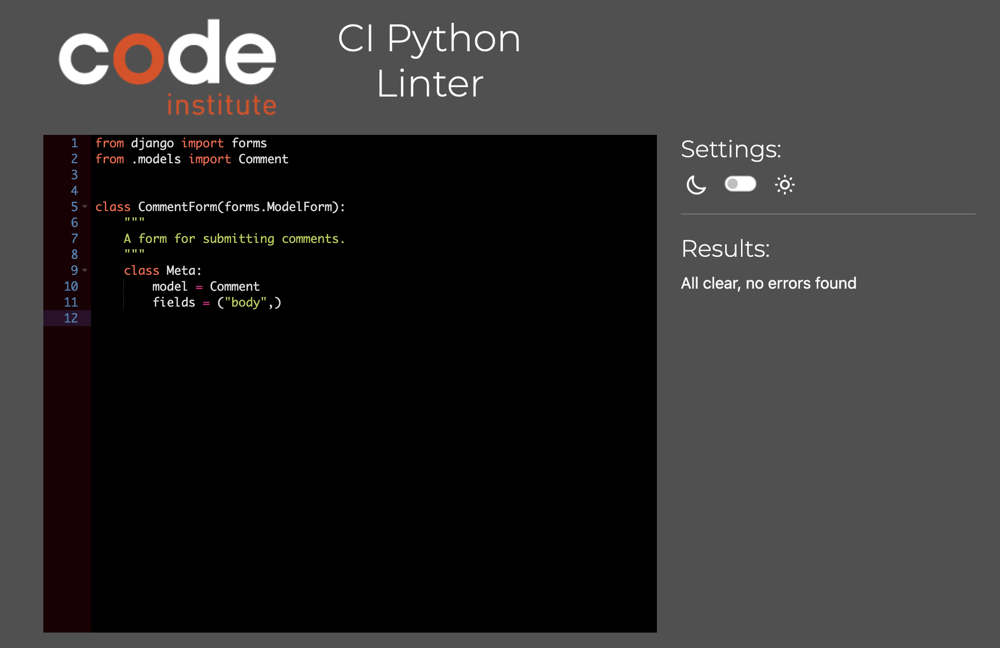
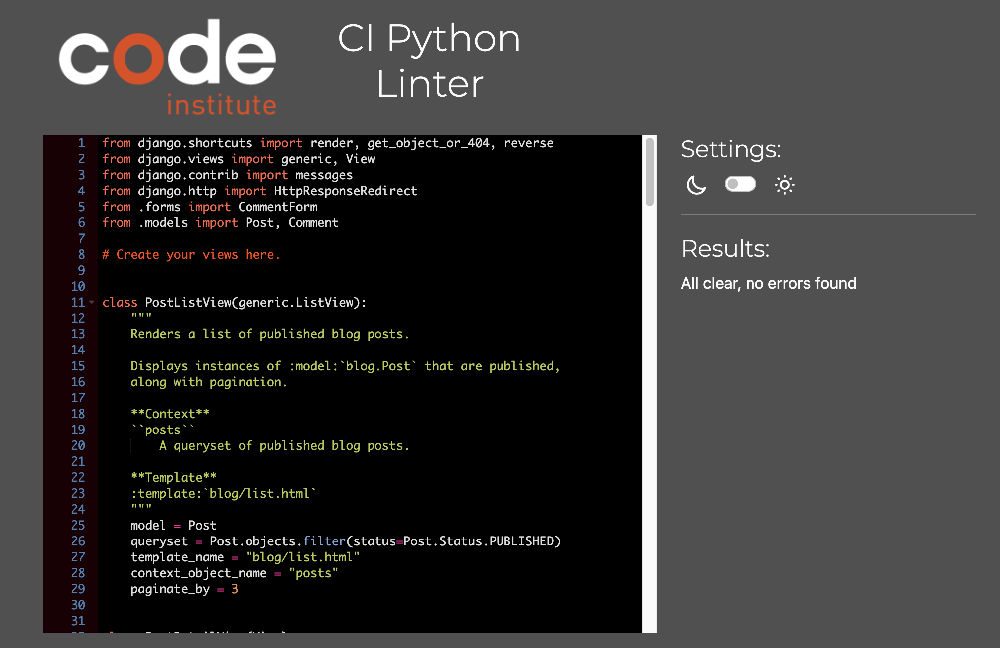
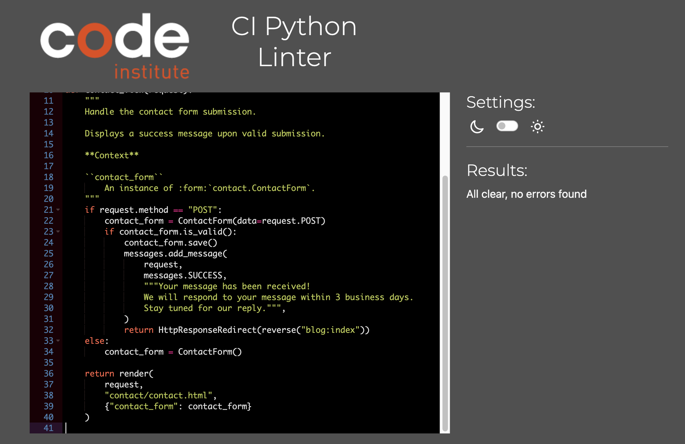
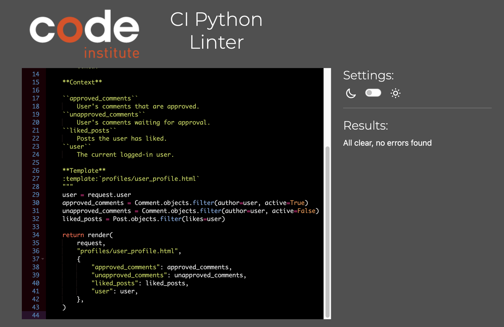

# Venture Vibes

## Testing

### HTML Validator

HTML files have been validated using [W3C Markup Validation Service](https://validator.w3.org/) 
A common theme and the only error throughout the validation checks is a CSS error caused by using a newer CSS feature by summernote.

HTML Validator Results

Homepage

Iceland Roadtrip

Post Detail

About

Contact Us

User Profile

404 Error

500 Error

In order to test this page, a 500 error has been simulated by raising an Exception in about views.

### CSS Validator
CSS file has been validated  using [W3C CSS Validation Service](https://jigsaw.w3.org/css-validator/)

CSS Validator Result

### Javascript Code Analyzer
JS file has been analyzed by using [JSHint](https://jshint.com/)

JS Hint Analysis

### Python Code Linter
All altered Python files have been validated using [CI Python Linter](https://pep8ci.herokuapp.com/)

CI Python Linter Analysis

About

admin.py

models.py

urls.py

views.py

Blog

admin.py

forms.py

models.py

urls.py

views.py

Contact

admin.py

forms.py

models.py

urls.py

views.py

Profiles

urls.py

views.py

Venture_Vibes

Altough settings.py has been altered, I have not included it in the validation as it is focused on configurations

urls.py

views.py

